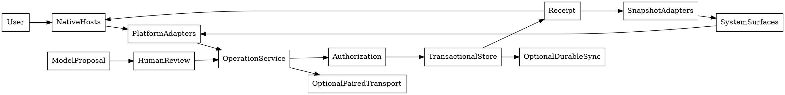

# Architecture

## Dependency direction

The pure domain core knows neither SwiftUI nor App Intents. Platform adapters translate system requests into domain operations. Hosts compose the adapters supported by their target; they do not discover arbitrary executable plugins at runtime.

Proposed source layout after bootstrap:

```text
AppleNativeLab.xcworkspace
Apps/                 iOS, macOS, watchOS, tvOS native host targets
Extensions/           share, widgets, controls, previews; advanced targets isolated
Packages/LabDomain/   IDs, operations, validation, receipts, contracts
Packages/LabStore/    local transactions, migrations, fixture namespaces
Packages/LabSupport/  capability probes, metadata-only diagnostics, evidence records
Packages/LabFeatures/ independent experiment modules and native adapters
Fixtures/             original, public-safe data and media
Tests/                unit, integration, UI, import fuzz, and recorded protocol cases
script/               future build/run/test/release entry points
Config/               tracked safe defaults; ignored local signing overrides
```

These names describe the target layout, not files already included in this pack. CORE-001 establishes the actual workspace. Avoid a package explosion: group small adapters by cohesive capability until separate compilation or dependency isolation is useful.

## Domain operation spine

A request carries a typed operation, actor/scope, request ID, expected revision where needed, and validated payload. The application service validates access and business rules, performs one transaction, persists an idempotency record, and emits an immutable receipt. A view, intent, extension import, authorized peer, or model tool is only an adapter around this flow.

A receipt contains the operation/request IDs, affected entity IDs, previous/new revisions, result status, user-readable summary, and an optional bounded undo operation. Never claim an irreversible external side effect is undoable. Model tools in the baseline produce proposals or read scoped records; they do not receive permission to commit destructive changes.

App Entities use stable identifiers and queries backed by the current local domain store. Display names may change without changing identity. Expensive media exports return a job handle through a suitable foreground flow rather than abusing an extension lifetime. Long-running work owns cancellation, checkpoints, and a progress source independent of its Live Activity.

## Storage and processes

Use one transactional local store behind a protocol. Choose SwiftData/Core Data/SQLite implementation during CORE-003 according to migration, extension, and conflict needs; this spec does not require a new third-party database library. Separate synthetic demo data from user-imported data by namespace and storage location. Reset Demo removes only the synthetic namespace.

An extension writes a small durable staging record into an explicitly configured App Group and finishes. It must not assume the main app is running. The app then validates and adopts the staging record. Use immutable widget snapshots, a bounded refresh policy, and safe default redaction; do not have widgets poll the full database or run inference.

Store secrets in appropriate scoped Keychain items. Security-scoped file bookmarks are local capabilities, not portable document fields. Do not sync them between devices. Keep large media outside small intent payloads; pass stable references or user-approved files using APIs designed for transfer.

## Multi-device architecture

Use three distinct adapters: **durable sync** for records/revisions; **live session transport** for active commands and snapshots; **continuation** for hints about what to open next. CloudKit is optional and opportunistic; local transport is explicitly paired and active; Handoff does not ensure the destination already has the document. Watch relay uses the paired phone rather than assuming a continuously reachable Watch server. [S15](SOURCE_INDEX.md#s15), [S19](SOURCE_INDEX.md#s19), [S60](SOURCE_INDEX.md#s60).

The first LAN session has one authoritative conductor. Clients submit typed commands; admitted changes receive an authoritative revision and receipt. High-frequency samples are replaceable and sequence-numbered. Reconnection requests a snapshot before command admission. The lab does not need a distributed consensus implementation or a universal mesh.

## Module contract

Each statically registered experiment supplies an ID/title/category, requirement descriptors, fixture factory, supported presentation factories, reset policy, action declarations, diagnostics metadata, and evidence/checklist links. A descriptor may be visible when its implementation is unavailable, but it must say so. It must not import unsupported frameworks into a platform target simply to advertise their names.

Portable components may be consumed by independently signed downstream apps. Those apps own their configuration, data, namespaces, extensions, and consent. The public host has no hidden owner mode or account-specific code path.

## Architecture diagram

The diagram is maintained as Graphviz DOT text; rendering is optional and not a build dependency.


