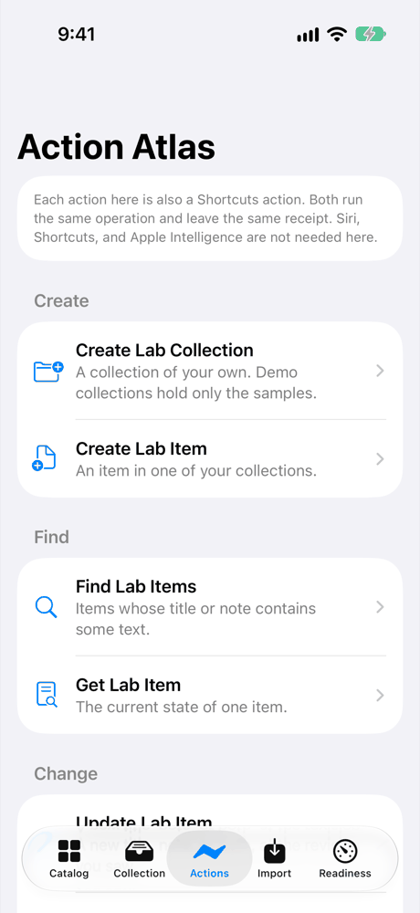
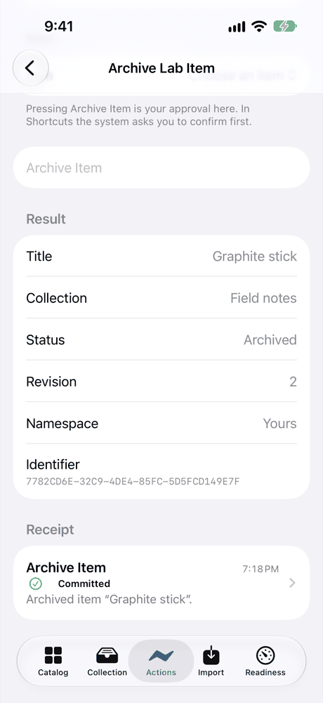
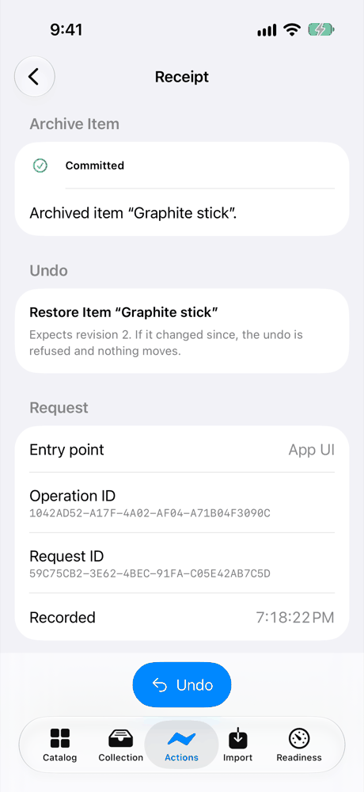

# Action Atlas: a walkthrough

Action Atlas ([LAB-001](../../experiments/LAB-001-action-atlas.md)) gives Native Lab one set of actions that works in two places: the app's own action browser, and Shortcuts. You can create a collection, add an item, find it, change it, archive it, and undo that, from either place. Whichever you use, the same operation runs and leaves the same receipt.

## What's real and what's simulated

Read this first, because it decides what the rest of the page can claim.

**The in-app path is verified on a physical iPhone. The Shortcuts path is verified in the simulator only.**

- **In the app, on a real iPhone.** The owner ran the action browser on an iPhone 16 Pro with iOS 27.0 and reports that every action worked. A read-only copy of the app's store from that iPhone backs this up: it holds the receipts of the changes, all made through the app. Nobody recorded the screen, and the actions that only read (Find, Get, and Export) leave no receipt, so for those we have the owner's word.
- **In Shortcuts, only in the simulator.** The live integration is Shortcuts or Siri running Native Lab's actions on your device. That hasn't happened yet: the iPhone's store holds no receipt from Shortcuts. The one Shortcuts run so far was Archive Lab Item in the iOS Simulator's Shortcuts app, during the implementation ticket ([LAB-001-A](../../tickets/LAB-001-A.md)). Siri hasn't been tried.
- **So the experiment is `implemented`, not `device-verified`.** Shortcuts is Action Atlas's main way in. It counts as verified on a device only after someone runs Archive Lab Item from Shortcuts on the iPhone, confirms, and a receipt from Shortcuts appears in the app's store.
- **The replay is a simulation of the logic, not of the system.** It runs the same operations the app runs, against a throwaway store, inside a test on the Mac. It proves what the operations do. It doesn't open Shortcuts, show a system dialog, or draw a screen.
- **Every screenshot says where it was taken.** All of them come from the iOS Simulator, not from the iPhone.

## Try it yourself

On a Mac, run `script/build_and_run.sh`, then choose Action Atlas in the sidebar or press ⌘4. On iPhone, open the Actions tab. You don't need an account, a network connection, Siri, or Apple Intelligence.



*iOS Simulator (iPhone 17, iOS 27.0), not a device: the Actions tab.*

The app starts with 12 original sample objects in three demo collections. Demo collections hold only the samples, so the first thing to do is make a collection of your own.

1. **Create Lab Collection.** Type a title, such as "Field notes", and press Create Collection. The collection is yours: Reset Demo will never touch it.
2. **Create Lab Item.** Your only collection is already chosen. Give the item a title and a note, then press Create Item.
3. **Find Lab Items.** Search for a word from the title or note. The search ignores case and accents, and lists results by title.
4. **Update Lab Item.** Pick the item and give it a new note. The form shows the revision you're looking at. If the item changed after you picked it, nothing is overwritten, and the receipt says so.
5. **Archive Lab Item.** Pick the item and press Archive Item. In the app, pressing the button is your approval. In Shortcuts, the system asks you to confirm first, and nothing happens if you cancel. Archiving hides the item without deleting it.

   

   *iOS Simulator (iPhone 17, iOS 27.0), not a device: the result of Archive Lab Item, with its receipt.*

6. **Open the receipt and undo.** Every change leaves a receipt with its status and summary, and most offer an undo. On a Mac the receipt opens in the inspector; on iPhone, tap it. Undo runs as a new change with its own receipt.

   

   *iOS Simulator (iPhone 17, iOS 27.0), not a device: the receipt and its Undo.*

7. **Reset Demo.** The samples you edited go back to how they started. Your own collection and item stay exactly as they are.

Each action has the same name in Shortcuts, so the same steps work there. A shortcut can also pass its own request ID, and running it again with that ID returns the first result instead of making a second change.

## How we checked it

| Check | Where it ran | What it shows |
|---|---|---|
| The action browser on a real iPhone | A physical iPhone 16 Pro, iOS 27.0, run by the owner | Every in-app action worked, by the owner's report. The store copied from the iPhone holds 6 receipts from the app, for Reset Demo, Create Collection, Create Item, Update Item, Archive Item, and Restore Item. No receipt came from Shortcuts. |
| Replay of the full interaction, twice | Mac, in a test, against a throwaway store | All 19 steps above, including a second Reset Demo, pass from a clean start. Both replays produce the same fingerprint, so the result doesn't depend on timing or chance. |
| The same replay, submitted as the App Intent entry point | Mac, in a test | The same final state, with every receipt naming the entry point it came through. No intent ran here; the next row runs them. |
| Both entry points in the Mac app | The Mac app's own test bundle, on fresh stores | The action browser's path and the App Intent types, given the same steps and request IDs, leave the same collections, items, and receipts. The intents are called directly, not by Shortcuts. |
| Refusals, cancellations, and retries | Mac, in tests | An archive without your approval is refused, and approving later under the same request commits it once. A cancelled step changes nothing. A request ID used for one change can't be reused for another, or from the other entry point. |
| Stale and duplicate state | Mac, in tests | A change made from an out-of-date copy of an item is refused and recorded, never applied over newer changes. A late retry returns the first result and leaves later edits alone. Two collections with the same title stay two collections, and making an item without naming one is refused until one is chosen. |
| Reset Demo beside imported data | Mac, in tests | An item imported the way the share extension will import it, plus everything created through the actions, is untouched by Reset Demo. An import can't land in a demo collection. |
| Accessibility, automated | The Mac app's test bundle, and the iOS Simulator | Each action and control has a name, and results read one item at a time. The open findings, such as action buttons that scroll off screen at the largest text size, are in the [accessibility review](../ACCESSIBILITY_REVIEW.md#action-atlas-review-lab-001-b). No person has tried VoiceOver, Voice Control, or Full Keyboard Access yet. |

The records are in [`evidence/LAB-001/`](../../evidence/LAB-001/). Each one names the source revision, the toolchain, the hash of every input, the entry point, and what it doesn't cover. [BUILD_STATUS](../BUILD_STATUS.md) lists every run with its command.

## Replay it

The replay script and its seed are in [`Fixtures/showcase/action-atlas/`](../../Fixtures/showcase/README.md#action-atlas). The seed is a byte-for-byte copy of the app's own demo seed.

```sh
swift test --package-path Packages/LabDemo --filter ActionAtlasShowcase
```

That runs the replay from a clean store several times and checks that the fingerprints match. To keep an export folder with the runs, the records, and a review of every file in it, follow the comment on `ActionAtlasShowcaseEvidence` in `Packages/LabDemo/Tests/LabDemoTests/ActionAtlasShowcaseTests.swift`.

## Not checked yet

- Shortcuts on a physical iPhone or iPad, and so the App Intents on a device.
- Siri.
- The Shortcuts app on the Mac.
- The system's "which collection?" question, asked when you have several collections of your own and don't name one.
- Apple's system-path intent tests (AppIntentsTesting).
- VoiceOver, Voice Control, and Full Keyboard Access, by a person, on any device.
- iPad layouts, and a build with an older (26) SDK.
