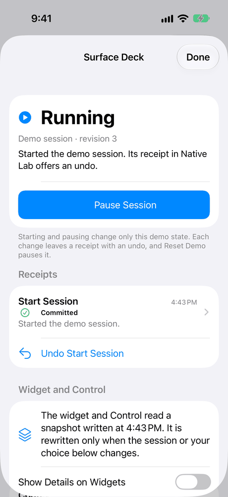
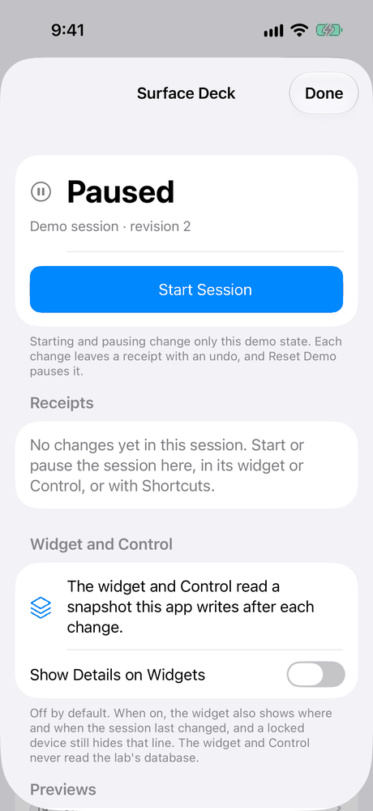
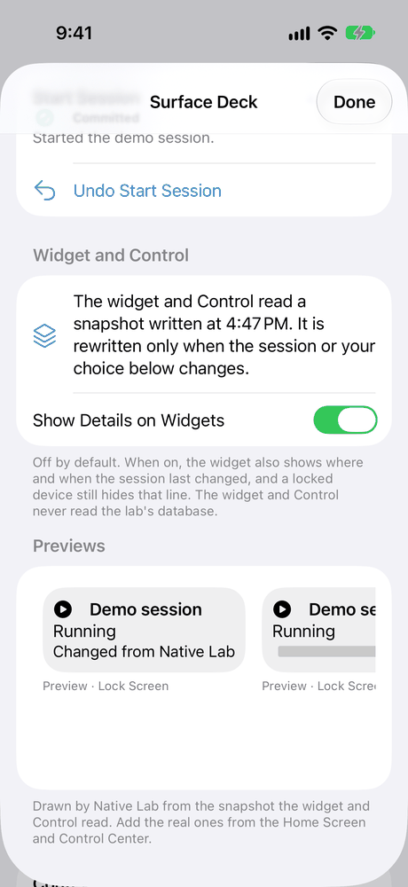

# Surface Deck: a walkthrough

Surface Deck ([LAB-004](../../experiments/LAB-004-surface-deck.md)) shows one small piece of state in three places: a widget on the Home Screen, a Control in Control Center, and a deck inside Native Lab. The state is a demo session that is either running or paused. Wherever you start or pause it, the same operation runs and leaves the same kind of receipt, with an undo.

## What's real and what's simulated

Read this first, because it decides what the rest of the page can claim.

**Nothing here has run on a physical device. The widget and the Controls have run only in the iOS Simulator.**

- **The live integration isn't shown yet.** The live integration is the widget and the Controls on a real iPhone, drawn by the system, changing the session from the Home Screen, Control Center, the Lock Screen, or the Action button. They can't be installed on the owner's iPhone today. They share the session with the app through an App Group, and the free signing team the lab uses can't sign one. That path is blocked, not failed.
- **In the iOS Simulator, the widget and the Controls work.** The simulator was an iPhone 17 Pro on iOS 27.0. From three clean installs of one build, the Open Surface Deck Control brought the app forward with the deck every time: 9 times, 3 of them before the app had ever run. The widget's toggle and the Demo Session Control each started the app in the background, changed the session, and left a receipt. Nothing crashed. A tap on a widget or Control that showed an out-of-date state changed nothing, its receipt said why, and the surface redrew.
- **The deck in the app is the fallback, and it needs no widget.** On a Mac, and in the iPhone build without widgets, the deck and its previews are the whole experiment. The Mac has no widget or Control of its own.
- **Two promises are checked in tests, not in the system.** One is that a locked device hides the private line. The other is that a widget says "May be out of date" when the system won't refresh it. Tests check both by drawing the widget's views and reading its timeline. Nobody has seen a real Lock Screen widget, a locked device, or a refresh the system refused.
- **The replay is a simulation of the logic, not of the system.** It runs the same operations the app runs, against a throwaway store, inside a test on the Mac. It proves what the operations do. It doesn't draw a widget, open Control Center, or start the app.
- **Every screenshot says where it was taken.** All of them come from the iOS Simulator, and all of them show the app's own window.

## Try it yourself

On a Mac, run `script/build_and_run.sh`, then choose Surface Deck in the sidebar or press ⌘7. On iPhone, open the Catalog, pick Surface Deck, and press Open Surface Deck. You don't need an account, a network connection, or any permission.

To try the widget and the Controls, build the `LabPhone-Surfaces` scheme for an iOS Simulator. On a device, this build needs a signing team that can use App Groups. Add the Demo Session widget from the Home Screen's widget gallery. Add the Demo Session and Open Surface Deck Controls from Control Center.

1. **Start the session.** In the deck, press Start Session. The state reads Running with its next revision number, and a receipt appears with an Undo Start Session button.

   

   *iOS Simulator (iPhone 17 Pro, iOS 27.0), not a device: the deck after Start Session.*

2. **Undo it.** The undo runs as a new change with its own receipt, and the session is paused again at the next revision.
3. **Use the widget or the Control.** Their toggles change the session even when Native Lab isn't running: the system starts the app in the background to make the change. The receipt shows up in the app like any other, and it names its entry point, App Intent.
4. **Open the deck from Control Center.** The Open Surface Deck Control brings Native Lab forward with the deck in a sheet. Done closes it.

   

   *iOS Simulator (iPhone 17 Pro, iOS 27.0), not a device: the deck the Open Surface Deck Control opened.*

5. **Tap an out-of-date surface.** Each widget and Control carries the revision it shows. Suppose the session changed after the surface was drawn. Then a tap changes nothing, and the receipt says so, for example "Not applied because the demo session changed: expected revision 1, found 2." The surface then redraws with the current state.
6. **Show details, and see what a locked device hides.** By default a surface shows only whether the session is running and when that was written. Turn on Show Details on Widgets, and the medium widget and the Lock Screen widget also say where the last change came from. The deck's "Lock Screen, locked" preview hides that line, as a locked device would.

   

   *iOS Simulator (iPhone 17 Pro, iOS 27.0), not a device: the app's own previews. The system did not draw them.*

7. **Leave the widget without a refresh.** Each widget timeline holds the state as written and the same state marked "May be out of date" an hour later. It asks for one refresh at that hour. If the system refreshes it, you never see the mark. If it doesn't, the widget stops looking current. A Control has no such mark.
8. **Reset Demo.** It pauses a running session and removes nothing. A widget or Control drawn before the reset then conflicts instead of applying.

## How we checked it

| Check | Where it ran | What it shows |
|---|---|---|
| Launches from clean installs | iOS Simulator (iPhone 17 Pro, iOS 27.0), one build installed three times from scratch | The simulator ran 21 launches with no crash. 9 went through Open Surface Deck: before the app had ever run, from the background, and after it was quit. Each showed the deck. The widget's toggle, the Demo Session Control, a tap on the widget, and a plain launch each worked too. Apart from its signature, the installed app matched the build file for file each time. |
| Out-of-date widget and Control | iOS Simulator | Four taps on stale surfaces each left a "Not applied" receipt and changed nothing. The widget and the Control then redrew with the current state. |
| Replay of the full interaction | Mac, in a test, against a throwaway store | All 9 steps pass from a clean start: Reset Demo, start, pause, undo, a second Reset Demo, and start again. Every replay, twice per entry point in each of three test runs, produced the same fingerprint, so the result doesn't depend on timing or chance. |
| The same replay, submitted as the App Intent entry point | Mac, in a test | The same final state, with every receipt naming the entry point it came through. No intent ran here; the next rows run them. |
| The qualification scenario in the Mac app | The Mac app's own test bundle, on a fresh store | The app's own snapshot writer and its intents were used, with the widget read from its file. All 25 checks held. A stale widget tap conflicts, and the store keeps the newer state. The snapshot holds no detail until you show it. A widget that isn't refreshed says "May be out of date" at 90 minutes. Reset Demo leaves an imported item alone. |
| What a locked device hides | Mac, in a test | The medium and Lock Screen widgets were drawn with the privacy redaction a locked device applies, and their words read back by text recognition. The "Changed from" line is gone, and the state is still readable. The small widget never draws that line. |
| A refused refresh | Mac, in tests | A widget's timeline reads current up to an hour, then "May be out of date" at 1, 2, 24, and 168 hours, and a tap on it reconciles. With no snapshot, the widget says "Open Native Lab", never a stale state. |
| Refusals, cancellations, and retries | Mac, in tests | An entry point that isn't allowed is refused and changes nothing. A cancelled change records nothing and can be retried under the same request. A retried request commits once, and a request ID reused for another change is refused. |
| Accessibility, automated | The Mac app's test bundle, and the iOS Simulator | The state, the toggle, the receipt, and its Undo read by name and work through the accessibility API. Each preview is one element that says it's a preview and never speaks the private line. At the largest text size on iPhone, the deck's toggle is on screen without scrolling. The open findings are in the [accessibility review](../ACCESSIBILITY_REVIEW.md#surface-deck-review-lab-004-b). No person has tried VoiceOver, Voice Control, or Full Keyboard Access yet. |

The records are in [`evidence/LAB-004/`](../../evidence/LAB-004/). Each one names the source revision, the toolchain, the hash of every input, the entry point, and what it doesn't cover. [BUILD_STATUS](../BUILD_STATUS.md) lists every run with its command.

## Replay it

The replay script and its seed are in [`Fixtures/showcase/surface-deck/`](../../Fixtures/showcase/README.md#surface-deck). The seed is a byte-for-byte copy of the app's own demo seed.

```sh
swift test --package-path Packages/LabDemo --filter SurfaceDeckShowcase
```

That runs the replay from a clean store several times and checks that the fingerprints match. To keep an export folder with the runs, the records, and a review of every file in it, follow the comment on `SurfaceDeckShowcaseEvidence` in `Packages/LabDemo/Tests/LabDemoTests/SurfaceDeckShowcaseTests.swift`.

## Not checked yet

- The widget and the Controls on a physical iPhone or iPad. This is blocked until a signing team that can use App Groups installs the `LabPhone-Surfaces` build.
- The deck on a physical iPhone. No device run was part of this check.
- A real Lock Screen widget, and a locked device.
- A refresh the system refused, and the hour before the "May be out of date" mark.
- The Action button and other hardware triggers, Shortcuts running the session's actions, and Siri.
- A widget or Control on the Mac or the Watch: neither is built.
- VoiceOver, Voice Control, and Full Keyboard Access, by a person, on any device.
- iPad layouts, and a build with an older (26) SDK.
