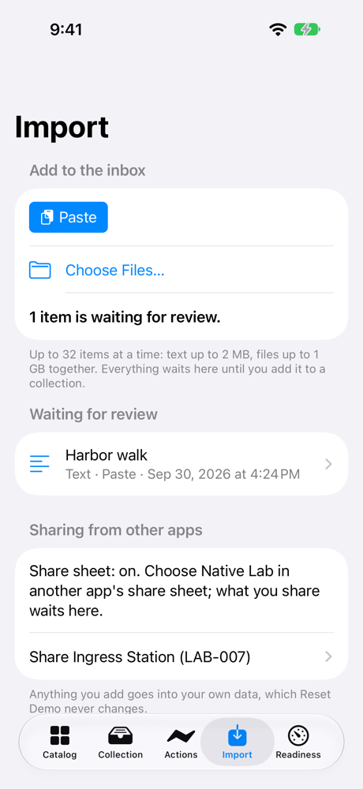
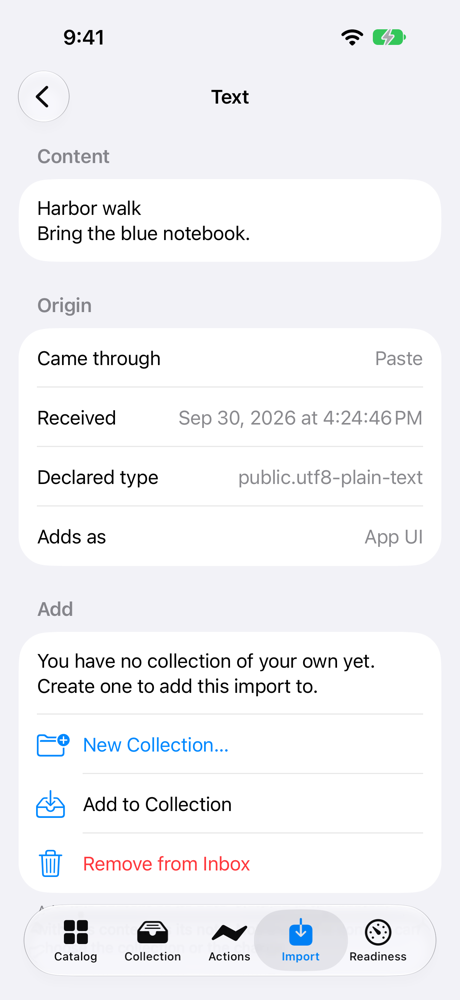
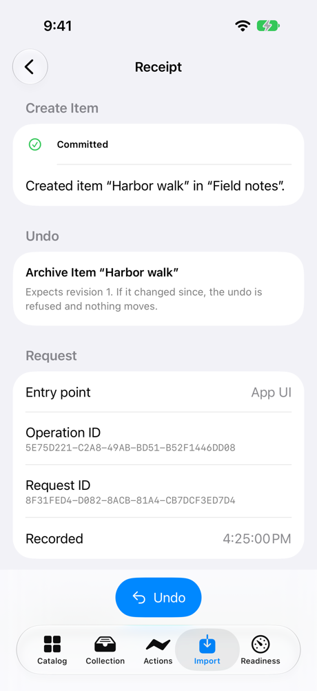
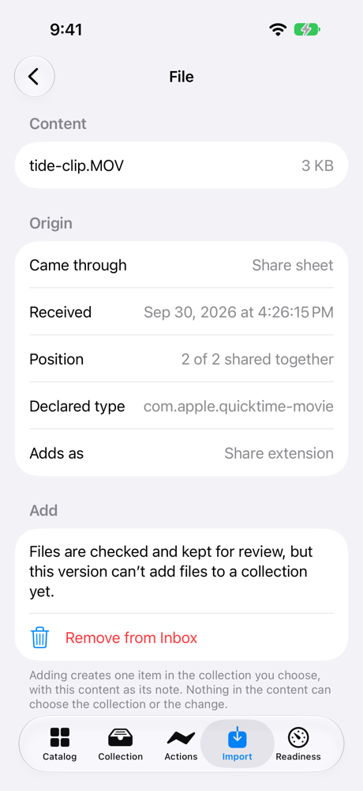

# Share Ingress Station: a walkthrough

Share Ingress Station ([LAB-007](../../experiments/LAB-007-share-ingress-station.md)) gives Native Lab an inbox for things that come from outside it: a note you paste, files you choose, and, in the iPhone build that includes it, whatever you share from another app. Nothing goes straight into your collections. Each thing waits in the inbox, where you can see what it is and where it came from, until you pick a collection and choose Add, or remove it.

## What's real and what's simulated

Read this first, because it decides what the rest of the page can claim.

**Sharing from another app has only run in the iOS Simulator. Paste and Choose Files ran on the Mac and in the simulator, not yet on an iPhone.**

- **Sharing from another app is the live integration, and it hasn't run on a device.** The share extension that puts Native Lab in other apps' share sheets is only in a separate iPhone build, and that build needs an App Group. A free Personal Team can't sign one, so the extension can't be installed on the iPhone we test with. In the iOS Simulator, which signs the App Group without a team, a photo and a movie shared from Photos reached the inbox.
- **Paste and Choose Files are the way in that works today, and they need no extension.** On the development Mac, Choose Files… showed the open panel and imported the files it picked. That run was driven through the Mac's accessibility interface by a test agent, not by a person's hand. In the iOS Simulator, the Paste button, the document picker, and Add all worked. None of this has run on a physical iPhone yet.
- **So the experiment is `implemented`, not `device-verified`.** It counts as verified on a device only after a share from another app on a real iPhone reaches the inbox and is added with a receipt. That needs a team that can use App Groups.
- **The replays are simulations of the logic, not of the system.** They run the same code the app runs, against throwaway folders and stores, inside tests on the Mac. They prove what the inbox and the operations do. They don't open a share sheet or draw a screen.
- **Every screenshot says where it was taken.** All of them come from the iOS Simulator, and they show only Native Lab's own screens.

## Try it yourself

On a Mac, run `script/build_and_run.sh`, then choose Share Inbox in the sidebar or press ⌘6. On iPhone, open the Import tab. You don't need an account or a network connection.

1. **Paste.** Copy a note in another app, then press Paste (or ⌘V on the Mac). The inbox says how many items are waiting, and the note appears with where it came from: Paste, and when.

   

   *iOS Simulator (iPhone 17 Pro, iOS 27.0), not a device: a pasted note waiting for review.*

2. **Review it.** Open the row. The review screen shows the content as plain text, where it came from, its declared type, and which entry point the Add will be recorded under. Links are shown as addresses and never opened.

   

   *iOS Simulator (iPhone 17 Pro, iOS 27.0), not a device: the review screen.*

3. **Add it.** Demo collections hold only the samples, so choose New Collection… first, give it a title, then press Add to Collection. The note becomes one item: its first line is the title and the whole text is the note. The receipt opens, with an undo.

   

   *iOS Simulator (iPhone 17 Pro, iOS 27.0), not a device: the receipt after Add.*

4. **Choose Files.** Choose Files… opens the system's file picker. Files wait in the inbox with their names and sizes, but this version can't add a file to a collection yet, and the row says so. You can remove them.
5. **Share from another app (iPhone, SystemSurfaces build only).** In another app's share sheet, choose Native Lab. The extension says how many items are waiting and finishes; open Native Lab to review them. Several things shared at once keep their order: "1 of 2", "2 of 2".

   

   *iOS Simulator (iPhone 17 Pro, iOS 27.0), not a device: a movie shared from Photos, waiting for review.*

6. **Reset Demo.** Anything you added is yours: Reset Demo never changes it, and it doesn't touch what's still waiting in the inbox.

## How we checked it

| Check | Where it ran | What it shows |
|---|---|---|
| Choose Files on the Mac | The Mac app on the development Mac, a Mac Studio (M5 Max) with macOS 27.0, driven through the accessibility interface | The open panel appeared. One file, then three at once, arrived as File picker imports in the panel's order. A file chosen twice was recognized as already waiting. |
| Paste, Choose Files, and a share from Photos | iOS Simulator (iPhone 17 Pro, iOS 27.0), the build with the share extension | The Paste button, the document picker, and a share of an image and a movie from Photos reached the inbox with their origins. Add turned the note into one item with a receipt. |
| From the intake to the receipt, twice | The Mac app's own test bundle, on fresh stores | The same content through Paste and Choose Files, and through the share extension's folder, is added as exactly the same items. Each receipt names the way it came in: App UI or Share extension. |
| Replay of what the review commits, twice | Mac, in a test, against a throwaway store | Creating a collection, adding the note and the link, and a second Reset Demo all pass from a clean start. Both replays produce the same fingerprint. |
| Cancelling a download | Mac, in tests | A file still being written by another process, as a cloud download is, can be cancelled at once. Nothing from the cancelled import is kept, and the same file imports normally afterwards. |
| Many attachments | Mac, in tests | 32 items in one share, or items spread over several parts of one share, keep their order and their "n of N" positions, even after the app reopens the inbox. |
| Bad or oversized content | Mac, in tests | Ill-formed text, unsafe file names, JSON too deep or with a repeated field, text one byte over 2 MB, and a file one byte over the 1 GB limit are each refused on their own, without keeping anything. The next import always works. |
| Refusals, cancellations, and stale reviews | Mac, in tests | Without your Add, or with an approval for another collection, nothing is added. A demo collection can't take an import. An import removed in another window, or changed after you reviewed it, isn't added. |
| Accessibility, automated | The Mac app's test bundle, and the iOS Simulator | The buttons are named, each waiting import reads as one line with commas, and the review screen can be completed by accessibility presses alone. Open findings, such as Add not being pinned on iPhone, are in the [accessibility review](../ACCESSIBILITY_REVIEW.md#share-ingress-review-lab-007-b). No person has tried VoiceOver, Voice Control, or Full Keyboard Access yet. |

The records are in [`evidence/LAB-007/`](../../evidence/LAB-007/). Each one names the source revision, the toolchain, the hash of every input, the entry point, and what it doesn't cover. [BUILD_STATUS](../BUILD_STATUS.md) lists every run with its command.

Two things are known and not yet fixed:

- If you paste twice within the same second, the inbox may list the second paste first. Items shared together always keep their order.
- If you paste a note and add it, then share the same note from another app and add it to the same collection, the second Add is refused with "This import conflicts with an earlier request". Nothing is stored twice; remove the second copy from the inbox.

## Replay it

The fixture is in [`Fixtures/showcase/share-ingress/`](../../Fixtures/showcase/README.md#share-ingress): the note, a text file, an image, and a one-second movie, all made for this project.

```sh
swift test --package-path Packages/LabDemo --filter ShareIngressShowcase
swift test --package-path Packages/LabFeatures --filter ShareIngress
```

The first replays what the review commits and checks that the fingerprints match. The second runs the whole interaction from the intake, through Paste and Choose Files and through the share extension's folder, and every qualification case above.

## What would make it device-verified

With a team that can use App Groups, install the `LabPhone-Surfaces` build on the iPhone. In Photos, share the image `harbor-sketch.png`; in Safari, share a page. Open Native Lab's Import tab, add the page's link to a collection of your own, and see a receipt whose entry point is Share extension. Then copy the app's store from the iPhone, read-only, and confirm that receipt is in it.

## Not checked yet

- The share extension on a physical iPhone or iPad, and so the App Group folder on a device.
- Paste and Choose Files on a physical iPhone.
- A real iCloud Drive or iCloud Photos download being cancelled.
- Drag and drop onto the Mac inbox, and a file a person copies in the Finder and pastes. Tests cover the code both use, not the Finder.
- A Mac share extension, which doesn't exist.
- VoiceOver, Voice Control, and Full Keyboard Access, by a person, on any device.
- iPad layouts, and a build with an older (26) SDK.
