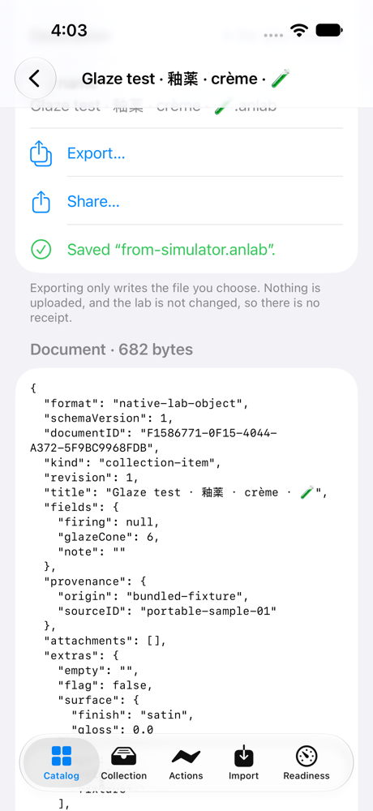

# Portable Objects: a walkthrough

Portable Objects ([LAB-008](../../experiments/LAB-008-portable-objects.md)) lets a lab object leave Native Lab as a file you can open and read, and come back in without being copied twice. The file is an `.anlab` document: plain JSON with the object's title, note, stable identifier, and any extra fields. Export it on a Mac, import it on an iPhone, export it again, and you get the same bytes. Import it a second time and nothing is added.

## What's real and what's simulated

Read this first, because it decides what the rest of the page can claim.

**The file path works on a real Mac. On iPhone it has run only in the simulator. Drags have not been tried by a person anywhere.**

- **On a real Mac, the file dialogs.** Export… and Import from File… ran in the Mac app on the development Mac, with the system's own save and open panels. A test agent pressed the buttons through the Mac's accessibility interface; no person did, and no pointer moved. The app imported a document the iPhone simulator had exported, saved it again with the same bytes, and refused six broken or hostile files.
- **On iPhone, only in the simulator.** The same round trip ran through Files in the iOS Simulator (iPhone 17, iOS 27.0), in the opposite direction too. No physical iPhone has run Portable Objects, and there is no iPad to try.
- **Drags are not proven.** Between two Mac windows, a drag has only been simulated: once with synthetic mouse events during the implementation ticket ([LAB-008-A](../../tickets/LAB-008-A.md)), and in tests as the data a drag carries. **A drag to Finder did not work:** Finder accepted the dragged file, then wrote nothing, and logged that it couldn't get permission to the drop location. That drag was synthetic, so a person's drag might behave differently, but nobody has tried one. Until someone does, use Export… to get a file.
- **So the experiment is `implemented`, not `device-verified`.** The Mac run supports the file dialogs on the Mac only. The drags, iPhone, and iPad still need a device run.
- **The replays are simulations of the logic, not of the system.** They run the same import and export code against throwaway stores, inside tests on the Mac. They prove what the code does with the bytes. They don't open a file dialog, Files, or Finder.
- **Every screenshot says where it was taken.** All of them come from the iOS Simulator, not from an iPhone.

## Try it yourself

On a Mac, run `script/build_and_run.sh`, then choose Portable Objects in the sidebar or press ⌘8. On iPhone, open the Catalog tab, choose Portable Objects, and press Open Portable Objects. You don't need an account or a network connection.

1. **Make a collection of your own.** An import goes into one of your collections, never a demo one. In Action Atlas, run Create Lab Collection first.
2. **Import Sample Object.** The app ships one original sample, "Glaze test · 釉薬 · crème · 🧪". Its title mixes a combining accent, Japanese, and an emoji; its note is empty; and it carries fields this version doesn't use. Nothing is added yet: you see a review first.

   

   *iOS Simulator (iPhone 17, iOS 27.0), not a device: the review of a document exported on the Mac.*

3. **Import.** The object joins your collection under its own identifier, and the change leaves a receipt with an undo.
4. **Export it.** Open the object. The preview lists every field, what each format keeps, where the file goes, and the document's exact text and size (682 bytes for the sample). Export… saves the `.anlab` file wherever you choose. Exporting changes nothing in the lab, so there's no receipt.

   

   *iOS Simulator (iPhone 17, iOS 27.0), not a device: the export preview after saving to On My iPhone.*

5. **Import the file somewhere else.** On another Mac or iPhone, Import from File… and choose it. The review says "New to this lab", and importing keeps the same identifier. Export it there and compare: the bytes are identical.
6. **Import it again.** The review says "Already in this lab", and there is nothing to import. If the file's title or note differ from the lab's copy, the review shows both and changes nothing unless you apply the file's version.
7. **Try a broken file.** A file that isn't valid JSON, is larger than 2 MB, comes from a newer version, claims permissions, names a field twice, or lists an attachment whose path climbs out of the object with `..` is refused with a sentence that says why. Nothing is imported or kept.

   

   *iOS Simulator (iPhone 17, iOS 27.0), not a device: a file with a path-traversal attachment, refused.*

8. **Reset Demo.** The demo samples go back to how they started. Objects you imported are yours, and Reset Demo leaves them and their documents exactly as they are.

On a Mac you can also drag an object's row or its export card to another window, which opens the same review there. That path has only been simulated so far; see above.

## How we checked it

| Check | Where it ran | What it shows |
|---|---|---|
| The file dialogs on a real Mac | The development Mac (macOS 27.0), the Mac app with the system's save and open panels, pressed through the accessibility interface by a test agent | A document the iPhone simulator exported imported under its stable identifier. Export… saved 682 bytes with SHA-256 `4dfbd2a9…`, identical to the simulator's file and the bundled sample, and did so again after the simulator's second export came back. Reimports by file and from the sample changed nothing. A malformed, an oversized, a path-traversal, a newer-schema, a permission-claiming, and a duplicate-field file were each refused with its sentence. The store held one imported object and 3 receipts, and nothing was left waiting in staging. |
| Files round trip, both directions | iOS Simulator (iPhone 17, iOS 27.0), driven by a UI test that is not part of the repository | The sample exported to On My iPhone with the same 682 bytes. After the app was removed and reinstalled, so its store was empty, the Mac's export imported as new under the same identifier and exported byte-identical. The same six files were refused with the same sentences. |
| The interaction in the Mac app | The Mac app's own test bundle, on two fresh stores | Export from one store, import the file into the other, export again: the same bytes, under one identifier. Five more documents, with decomposed accents, an emoji sequence, right-to-left and CJK text, empty and null notes, empty containers, and Unicode field names, came through both stores byte for byte. Reimports by file, by drop, and from the sample add nothing. The traversal file is refused by file and by drop. Reset Demo leaves the imported object alone. |
| Replay of the full interaction, twice | Mac, in a test, against throwaway stores | Import, export, import elsewhere, export, reimport three ways, apply a changed copy and undo it, refuse the hostile files, and Reset Demo. Two replays from clean stores give identical results. |
| Unicode and empty fields | Mac, in tests | Titles in eight scripts and forms, with every form of note (empty, null, absent, missing fields, text), and empty or absent optional parts at every level, all come back byte for byte. Titles that look the same but are written differently stay different objects. |
| Path-traversal attachments | Mac, in tests | Sixteen unsafe attachment paths, including escaped dots, lookalike slashes and dots, and hidden control characters, are refused from memory and from a file, with nothing staged or stored. Path-like text elsewhere in a document stays plain text. |
| Refusals, cancellations, and stale state | Mac, in tests | An entry point without permission to change the lab can't import. A closed review can't be committed. A cancelled import changes nothing and can be retried once. If the lab changes while you review, the import stops and asks you to review again. Two windows importing the same object commit it once. |

The records are in [`evidence/LAB-008/`](../../evidence/LAB-008/). Each one names the source revision, the toolchain, the hash of every input, where it ran, and what it doesn't cover. [BUILD_STATUS](../BUILD_STATUS.md) lists every run with its command.

## Replay it

The sample is in `Packages/LabFeatures/Sources/PortableObjects/Resources/sample-object.anlab`, and the hostile files are in [`Fixtures/LAB-008/`](../../Fixtures/LAB-008/README.md). All of them are original and synthetic.

```sh
swift test --package-path Packages/LabFeatures --filter PortableObjects
```

That runs the replay from two clean stores, twice, with the Unicode, traversal, reimport, and boundary tests. To run the interaction inside the Mac app and keep its record, follow the comment on `PortableObjectsHostEvidenceTests` in `Tests/LabMacTests/PortableObjectsHostEvidenceTests.swift`.

## Not checked yet

- Portable Objects on a physical iPhone, and anything on an iPad, including drags between iPad windows.
- A person's drag, on any device: between Mac windows, to Finder, or into another app. A synthetic drag to Finder wrote no file.
- Drags into apps other than TextEdit and Finder, and a drop from another app on iPhone.
- Share… on either platform.
- Saving over an existing file of the same name in the iPhone simulator's Files; the check saved under a new name.
- Files that arrive from AirDrop, iCloud Drive, or another app. The simulator's files were placed in On My iPhone directly.
- VoiceOver, Voice Control, and Full Keyboard Access, by a person, on any device.
- `.anlabpack` documents and attachments: a document that lists attachments is refused, because the lab doesn't store attachments yet.
- A build with an older (26) SDK.
