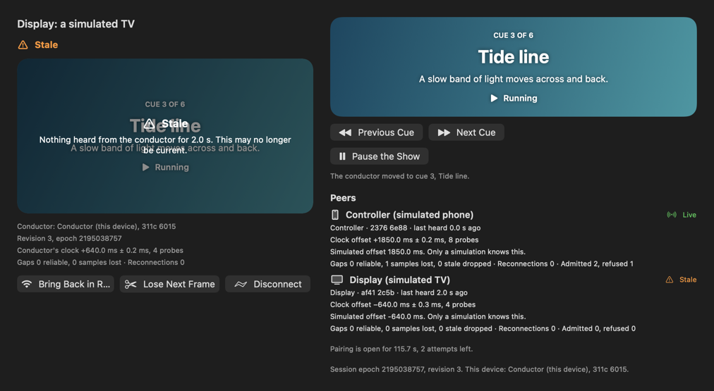
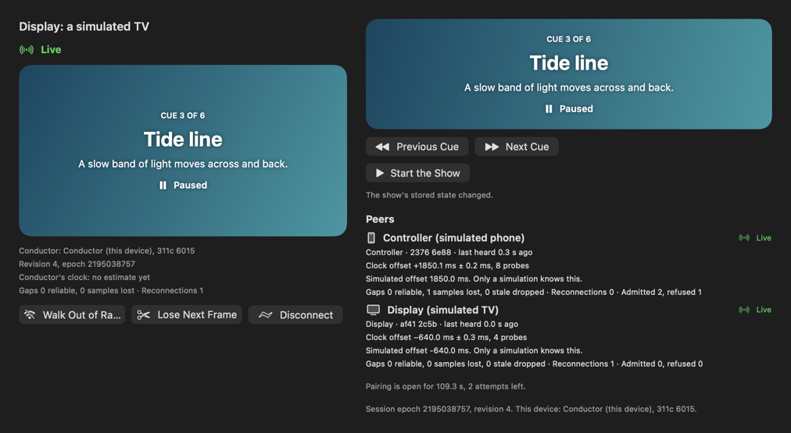
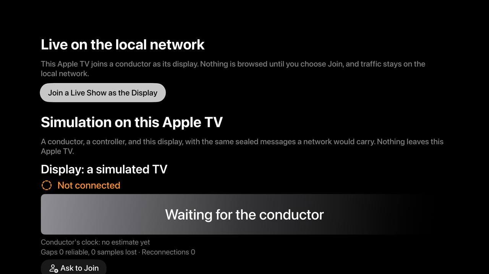

# Local Constellation: a walkthrough

Local Constellation ([LAB-019](../../experiments/LAB-019-local-constellation.md)) runs a small show across devices with no internet server: a Mac conducts, a phone controls, and a television displays. The phone moves between cues and points at the screen. When it asks to start or pause the show, the person at the Mac decides, and the change leaves a receipt like any other in the lab. Devices pair once with a six-digit code, then recognize each other by key.

## What's real and what's simulated

Read this first, because it decides what the rest of the page can claim.

**Nothing here has run between two devices, and nothing has run on a physical device. The live path has not been tried on a network.**

- **The live integration isn't shown yet.** The live integration is a Mac, an iPhone, and an Apple TV on one Wi-Fi network, finding each other with Bonjour, the system asking for local network permission, and the show running across them. No one has done that. The steps to try it are under [Try the live path](#try-the-live-path), and each one is still `not-run`.
- **The simulation is the fallback, and it is what you can try today.** On one device, the experiment runs a conductor, a controller, and a display side by side. They pair with a code, send commands and pointer samples, measure each other's clocks, and go stale when a link goes quiet. The bytes between them are sealed exactly as a network would carry them; they just never leave the app. It ran in the Mac app and in the Apple TV app in the tvOS Simulator.
- **Two processes did talk over TCP, on one Mac's loopback only.** A test process on the Mac conducted a show, and the Apple TV app in the tvOS Simulator joined it as the display, over TCP on the Mac's own loopback interface. They paired with the code, the display followed the show, rejoined without a code, and an unpaired identity was refused. Nothing was advertised or browsed, and no traffic reached a network. The code went from one side to the other through a file, standing in for a person. Round trips over loopback are not network measurements, so no latency is claimed.
- **The replays are simulations of the logic, not of a network.** They run the real session layer between in-process devices with clocks the test controls. They prove what the protocol does with messages. They don't prove what Wi-Fi does.
- **Every picture says where it was drawn.** The Mac pictures are the app's own views, drawn by the Mac app's test bundle. The Apple TV pictures are screenshots from the tvOS Simulator.

## Try it yourself

On a Mac, run `script/build_and_run.sh`, then choose Local Constellation in the sidebar or press ⌃⌘5. On iPhone or iPad, open the Catalog, pick Local Constellation, and press Open Local Constellation. On Apple TV, open its page in the catalog and press Open Local Constellation. You don't need an account, a network connection, or any permission for the simulation.

1. **Try a device that was never paired.** Under Test the session, press Unpaired Device Tries to Join. A device that knows the conductor's identity, but was never paired with it, asks to rejoin. It's refused before it sees anything: the conductor says it received no session data.
2. **Pair the controller.** In the controller's section, press Ask to Join. The conductor shows a six-digit code and who is asking. Type the code into the controller and press Pair, then press Allow at the conductor. Allow only after the controller says the code matched: that's what stops a device in the middle from pairing in its place. A wrong code, Deny, or Cancel pairs nothing and shares nothing.

   

   *Mac, drawn by the Mac app's test bundle, not a device demonstration: after both devices paired and the controller's start was allowed.*

3. **Pair the display** the same way.
4. **Move the show.** The controller's Next and Previous move between six cues, and the display follows. Drag on the pointer pad, or use its arrow buttons, and a dot moves on the display. Only the newest pointer position matters, so a late one is dropped.
5. **Ask to start.** The controller's Ask to Start waits at the conductor. Nothing is stored until the person there presses Allow; then the show starts through the lab's own operation service, and the receipt says it came from an authorized peer. Decline changes nothing. A request nobody answers expires after 30 seconds.
6. **Send a command from an old view.** Press Walk Out of Range on the controller, move the show at the conductor with Next Cue, press Bring Back in Range, then press Next on the controller. The controller had not seen the conductor's move, so its Next is refused as stale, and the controller then shows the current cue. Nothing moved twice.
7. **Let a device go quiet.** Take the display out of range. After 2 seconds both its board and the conductor's roster say Stale, in words, not just in color. After 8 seconds both say Disconnected, and the roster keeps the display listed. Bring it back and press Reconnect: it rejoins without a code, because both sides pinned each other's key.

   

   *Mac, drawn by the Mac app's test bundle, not a device demonstration: the display's link silently down. The warning overlaps the dimmed cue title; that is finding 5 in the [accessibility review](../ACCESSIBILITY_REVIEW.md#local-constellation-review-lab-019-b).*

8. **Restart the conductor.** Restart the Conductor starts a new session epoch, as if the Mac relaunched. The devices reconnect without a code, and anything they sent before the restart is refused.
9. **Reset Demo.** The show's running flag is demo state, so Reset Demo pauses it and the display follows. Your own collections and items are left exactly as they were. Start Over in the simulation forgets every pairing and leaves the stored show alone.

   

   *Mac, drawn by the Mac app's test bundle, not a device demonstration: after Reset Demo.*

On Apple TV the same simulation runs on the television, with the display at the top. The remote reaches every control.



*tvOS Simulator, not a device: the screen opened with the remote.*


*tvOS Simulator, not a device: the display asks for the code the conductor shows.*

## Try the live path

The live path needs a Companions build: `LabMac-Companions` on the Mac, `LabPhone-Companions` on the iPhone, and the Apple TV app. The CoreLocal builds carry no network code or entitlement, and say so on the page. None of these steps has been run; record each result with `DeviceRunEvidence`.

1. Put the Mac, the iPhone, and the Apple TV on the same Wi-Fi network. Cellular and peer-to-peer Wi-Fi are never used.
2. On the Mac, open Local Constellation and press Host a Live Show. On iPhone and Apple TV the system asks to allow local network access the first time something is browsed; nothing is advertised or browsed before you press a button.
3. On the Mac, press Pair a Device. On the iPhone, press Join as Controller, then choose the Mac. Type the code the Mac shows, press Pair, and press Allow on the Mac after the iPhone says it matched.
4. On the Apple TV, press Join a Live Show as the Display, choose the Mac, and pair the same way.
5. Move the show from the iPhone; the television follows. Ask to Start on the iPhone and Allow it on the Mac; the receipt appears in the Mac's inspector as Authorized peer.
6. Turn off the iPhone's Wi-Fi. Record when the Mac's roster says Stale and Disconnected, and when the iPhone's board says Nothing heard. Turn Wi-Fi back on and press Rejoin.
7. Deny local network access on the Apple TV (Settings, then Privacy and Security, then Local Network) and press Join again. Record what the page says. It should say access is off and point to the simulation.
8. Record the clock offset, uncertainty, gaps, and reconnections from the Mac's roster. These are the first network measurements this experiment would have.

## How we checked it

| Check | Where it ran | What it shows |
|---|---|---|
| The fallback in the Mac app | The development Mac (macOS 27.0), the Mac app's own test bundle on a fresh store, its views pressed through the accessibility interface by a test | An unpaired device was refused with no session data. Both devices paired with the code, which the conductor reads digit by digit. The controller's Ask to Start waited for Allow and committed as the authorized peer, with a receipt in the app's list. A Next from an older view was refused as stale and the controller caught up. The quiet display read Stale on its board and in the roster, then Disconnected after 8 seconds, then rejoined without a code. Reset Demo paused the show and left the person's collection and item alone. After a restart the controller rejoined in the new epoch. |
| The fallback in the Apple TV app | tvOS Simulator, the Apple TV app's own test bundle | The same interaction, with the show stored in memory as the Apple TV app stores it: refusal, pairing, a stale command, staleness on both sides, and an allowed start. Nothing was browsed. |
| The Apple TV screen with the remote | tvOS Simulator, driven by the Siri Remote alone through a UI test | Focus reaches Open Local Constellation, the display's Ask to Join, and Cancel; the conductor shows the code and Allow; Cancel pairs nothing; Menu returns to the detail page. The Join a Live Show button is never pressed. The code is not typed, because that opens the system keyboard. |
| Two processes over loopback TCP | One Mac: a macOS test process as the conductor and the Apple TV app's test bundle in the tvOS Simulator as the display, on the loopback interface only, with nothing advertised | The display paired with the code the conductor showed (passed through a file), and the conductor allowed it only after the display said it matched. It followed the conductor to cue 3, running. Each side estimated the other's clock from probes across the two processes. The display dropped its link without a goodbye, the conductor's roster showed it Disconnected, and it resumed without a code. An identity the conductor never paired was told to pair first, with no session data. When the conductor stopped, the display said so. |
| The whole interaction, replayed twice | Mac, in a test, with in-process devices and clocks the test controls | Refusal, pairing, cues, pointer samples, an allowed start with its receipt, a stale command, a declined pause, the display stale then disconnected then back, Reset Demo, and a restart. Two replays from clean stores agree on every envelope's bytes and every outcome. |
| The session layer's contract | Mac, in tests | The rules later experiments rely on: a command queued offline is judged on the revision its person saw; a lost answer is sent again from the record, never applied twice; a paired device can't speak for another or as the conductor; a replayed sealed frame closes the link; each role receives only its own messages; pairing closes by itself. |

The records are in [`evidence/LAB-019/`](../../evidence/LAB-019/). Each one names the source revision, the toolchain, where it ran, and what it doesn't cover. [BUILD_STATUS](../BUILD_STATUS.md) lists every run with its command.

## Replay it

The cue sheet is `Packages/LabFeatures/Sources/LocalConstellation/Resources/cue-sheet.json`, and the hostile wire messages are in [`Fixtures/LAB-019/`](../../Fixtures/LAB-019/README.md). All of them are original and synthetic.

```sh
swift test --package-path Packages/LabFeatures --filter "PeerSession|LocalConstellation"
```

That runs the replay twice, the qualification and contract suites, and the network adapter's tests over this Mac's loopback. To run the interaction inside the Mac app and keep its record, follow the comment on `ConstellationHostEvidenceTests` in `Tests/LabMacTests/ConstellationHostEvidenceTests.swift`.

## Known issues

- None open. Qualification found that Forget left a device's held request on screen and that Allow still started the show as that device's request. Now Forget withdraws the request, the device is told so, and an Allow pressed afterwards is refused with the reason and changes nothing.

## Not checked yet

- Anything between two devices, on any network: Bonjour, the local network permission prompt and its denial, Wi-Fi loss and delay, and real clock offsets.
- Any physical Mac, iPhone, iPad, or Apple TV running Local Constellation.
- The Companions builds launched by a person, and their Host and Join controls.
- The iPhone and iPad pages, beyond building them.
- Typing the code with the Apple TV's keyboard, and pairing from the remote.
- The Watch relay, which the experiment's hosts list and no build has yet.
- VoiceOver, Voice Control, Full Keyboard Access, and large text, by a person, on any device.
- A build with an older (26) SDK.
