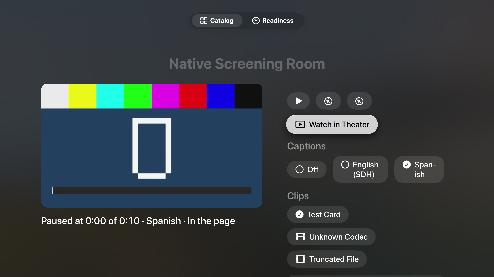

# Native Screening Room

LAB-031 remains `implemented`. This qualification runs real AVFoundation over original local clips in automated Mac tests and simulator hosts. Interruption, route, and surface signals in package tests are injected. They do not prove calls, unplugged outputs, Picture in Picture, AirPlay, or a physical iPhone, iPad, or Apple TV. The companion panel is explicitly an in-app simulation; it has no paired transport.

Open Native Screening Room in the catalog. On Mac, View › Native Screening Room (⌃⌘1) opens the same destination. The default Test Card is a ten-second original H.264/AAC clip with generated shapes, tone, and written captions; no sign-in or imported media is needed. Start playback and choose English (SDH) or Spanish in Captions. Automatic system caption preferences are deliberately off at first open; choose a track explicitly.

Choose Watch in Theater, then Back to Page (Menu on Apple TV). The same player owns both presentations. The caption choice and position should remain; receipts identify the presentation commands. The Mac theater is a sheet. System full screen, Picture in Picture, and AirPlay are entered through native controls only, subject to the displayed readiness. A capability reading is availability, not evidence that the surface was exercised.

Pause at a recognizable position, leave and reopen the app. Its experiment-owned resume point restores position and captions, paused in the page. Apple TV stores that point in Caches, which the system may clear. Select Unknown Codec: the real asset probe should report Format not supported (`lab0`), with no item handed to the player. Truncated Clip should report Clip can't be opened (AVFoundation -11829). Choose Test Card to recover. No protected fixture is included: protection classification is tested, but DRM playback has not been observed.

In Companion remote, Play and Pause use the authorized-peer command path. Reset is refused. Reset Screening… in the host asks for confirmation and removes only the screening resume point, returning to the start with captions off. Cancel the dialog to keep the session. Do not use Reset Demo as a substitute for this experiment's reset.

The clean replay test uses a fresh temporary file store and an original sentinel file, never imported user data. It checks that the sentinel bytes survive reset. The bundled media hashes and rights are recorded in [the fixture record](../../Fixtures/LAB-031/README.md); qualification results live in [evidence/LAB-031](../../evidence/LAB-031/).

Before claiming device verification, the owner must test interruption/resumption and an output removal on actual iOS hardware, captions through actual native surfaces on the declared hosts, and applicable remote commands. Manual VoiceOver, Voice Control, keyboard access, iPad layouts, large text, PiP, and AirPlay remain unverified. The two screenshots below are from the tvOS simulator, driven by `ScreeningRoomRemoteUITests`, not from an Apple TV device. They contain only the app and original Test Card; ancillary PNG metadata was removed without changing the image payload. No media export is included.

The remote test kept the clip paused at 0:00; it proves selection and presentation retention, not visible caption-cue rendering during playback. Nonzero seek/resume is covered separately by the fixture-backed model tests.
