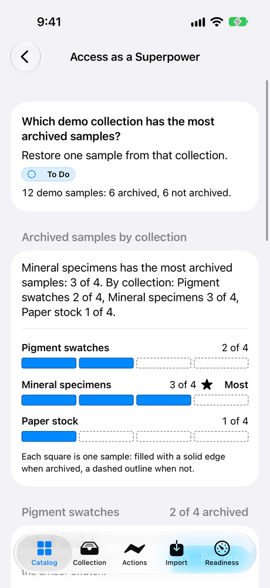
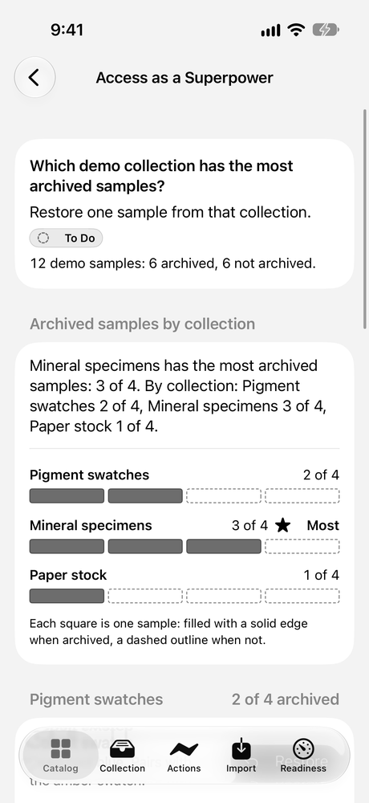
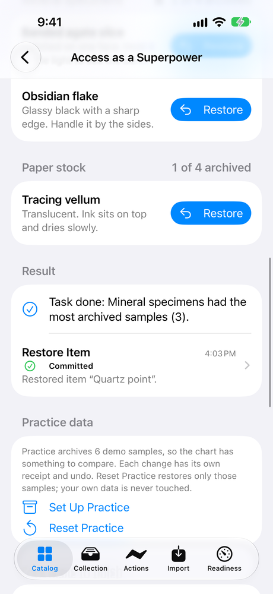
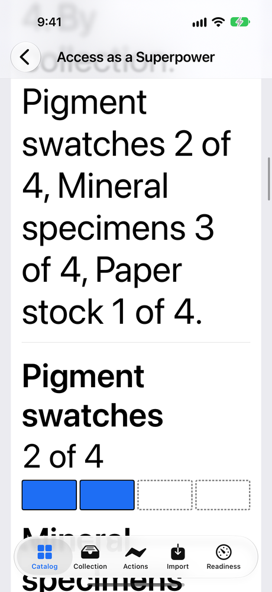

# Access as a Superpower: a walkthrough

Access as a Superpower ([LAB-035](../../experiments/LAB-035-access-as-a-superpower.md)) asks one question about the lab's demo samples: "Which demo collection has the most archived samples? Restore one sample from that collection." You can answer it by looking at a chart, with VoiceOver, with the keyboard, or by listening to the chart as an Audio Graph. Without the chart, a summary sentence and a plain list carry the same numbers. Whichever way you take, the same restore runs and leaves the same receipt, with an undo.

## What's real and what's simulated

Read this first, because it decides what the rest of the page can claim.

**No person has used VoiceOver, Voice Control, Full Keyboard Access, or the Audio Graph on this experiment yet. Everything below was checked automatically, on the Mac and in the iOS Simulator.**

- **The live integration is a person with an assistive technology.** That means someone hearing VoiceOver read the chart and finish the task, playing its Audio Graph and picking out the highest tone, or doing it all by voice or keyboard. None of that has happened. The [manual passes](LAB-035-manual-passes.md) are the script for it, and every result in them is still not run.
- **On the Mac, the checks read what an assistive technology is given.** The Mac app's own test bundle, and a small program talking to the running app from outside it, read each bar's words, its Restore actions, the list's rotor, and the chart's Audio Graph data. Then they used them to finish the task. Nothing was spoken aloud, and no tone was played.
- **On iPhone, only the iOS Simulator.** A test drove the page by the names VoiceOver would read, at the default text size and at the largest one with Increase Contrast. No physical iPhone or iPad has run this experiment.
- **So the experiment is `implemented`, not `device-verified`.** It counts as verified on a device only after a person finishes the task with VoiceOver on the Mac or an iPhone, and the pass is recorded.
- **The replay is a simulation of the logic.** It runs the task's operations against a throwaway store inside a test on the Mac. It proves what the operations do. It doesn't draw the chart or talk to any assistive technology.
- **Every screenshot says where it was taken.** All of them come from the iOS Simulator. One is the same screenshot turned to grayscale afterwards, to show the chart without its color. It isn't a device's grayscale filter.

## Try it yourself

On a Mac, run `script/build_and_run.sh`, then choose Access as a Superpower in the sidebar or press ⌘5. On iPhone, open the Catalog tab, choose Access as a Superpower, and press Open Access as a Superpower. You don't need an account or a network connection.

1. **Set Up Practice.** A new install has nothing archived, so the question has no answer yet. Set Up Practice archives six of the demo samples, each as its own change with its own receipt and undo: three mineral specimens, two pigment swatches, and one paper stock sample.
2. **Read the chart.** Each collection is a row of squares, one per sample. An archived sample is a filled square with a solid edge, and one that isn't archived is a dashed outline. Each row also gives its count in digits, and the longest one has a star and the word "Most". The sentence above the chart says the same thing in words.

   

   *iOS Simulator (iPhone 17, iOS 27.0), not a device: the chart after Set Up Practice.*

   

   *The screenshot above, converted to grayscale after it was taken. The answer doesn't depend on color.*

3. **Restore one sample from Mineral specimens.** Choose any of the four ways:
   - **By sight.** On iPhone, tap Restore beside Quartz point. On the Mac, select Quartz point in the list and choose Restore Sample.
   - **With VoiceOver.** Each bar reads its collection, then "3 of 4 samples archived, the most" or its own count. The bar with the most has a Restore action for each of its archived samples. On the Mac, open them with VO-Command-Space. On iPhone, swipe up or down. The list also has an Archived Samples rotor.
   - **By keyboard, on the Mac.** Press ⌘5, then Tab to the list. Choose a sample with the arrow keys, then press Return. ⌥⌘L shows its receipt, and ⌥⌘Z undoes it.
   - **By ear.** The chart carries an Audio Graph. VoiceOver can describe it and play it as three tones, one per collection. The highest tone is Mineral specimens. Then use that bar's Restore action.
   - **Without the chart.** The summary sentence gives every count. Below it, each collection's archived samples are listed with their own Restore button.
4. **Read the result.** The page says "Task: Done" and "Task done: Mineral specimens had the most archived samples (3)." VoiceOver hears one announcement that covers both the receipt and the result.

   

   *iOS Simulator (iPhone 17, iOS 27.0), not a device: the result and its receipt.*

5. **Open the receipt and undo.** The receipt names the change and offers an undo, which archives Quartz point again. Undo runs as a new change with its own receipt, and the task is to do again.
6. **Try a miss.** Restore Tracing vellum from Paper stock. It's a real change with a receipt, but the page says "Task not done: Paper stock had 1 archived sample, and Mineral specimens had the most (3)."
7. **Reset Practice.** It restores only the practice samples that are still archived. A sample you archived yourself, and anything of your own, stays exactly as it is.

At the largest text size on iPhone, each bar puts its count under its name, so no word is cut. The Open button and the receipt's Undo can be pressed without scrolling, although the lower part of the Open button sits under the pinned Read the Specification bar.



*iOS Simulator (iPhone 17, iOS 27.0), not a device: the first bar at the largest accessibility text size with Increase Contrast.*

## How we checked it

| Check | Where it ran | What it shows |
|---|---|---|
| Replay of the full interaction, twice | Mac, in a test, against a throwaway store | All 41 steps pass from a clean start: Set Up Practice, the restore, its undo, a miss, the person's own collection and item, a demo sample the person archived, and Reset Practice. Both replays produce the same fingerprint, in two separate runs, so the result doesn't depend on timing or chance. |
| The experiment's own code against the replay | Mac, in a test | Set Up Practice, the restore, the miss, and Reset Practice build exactly the replay's operations, and the chart and the result read as the chart fixture says. |
| Five ways to finish, in the Mac app | The Mac app's own test bundle, each way on a fresh store | The visible button, a bar's Restore action, the keyboard in the list, the Audio Graph's highest value, and the page without its Audio Graph each restore Quartz point, with the same receipt, the same announcement, and the same saved state. All 60 comparisons matched. |
| The whole task through the accessibility tree | The Mac app's own test bundle | Set Up Practice, a bar chosen by the words it reads, that bar's Restore action, the receipt's Undo, and Reset Practice, all pressed by name. |
| The running Mac app, from outside | A separate program using the accessibility API against the Mac app | What an assistive technology receives: each bar's words and its Restore actions in title order, the Archived Samples rotor, and the chart's Audio Graph data, with its title, summary, both axes, and the values 2, 3, and 1. The bar's action, the Audio Graph's highest value, a list row's action, and the Restore Sample button each finished the task or reported the miss. |
| No information by color alone | The Mac app's own test bundle | An archived square and an active one are drawn and measured. With the fill made the same color as the background, they still differ: one outline is unbroken and the other is dashed, at standard and increased contrast. |
| Without the Audio Graph | The Mac app's own test bundle | With no chart description at all, the summary and the list finish the task under every display setting the tests cover. |
| Refusals, cancellations, and retries | Mac, in tests | Practice can't archive without the person's approval. A cancelled Set Up Practice keeps what it had already done, each change with its receipt, and Reset Practice undoes exactly that. A second press while a restore runs commits once. |
| Stale state | Mac, in tests | A restore from a chart that's out of date is refused and recorded, never applied over the newer change. The page then shows the newer state, and the next restore works. |
| Reset Practice beside your own data | Mac, in tests | A collection you made, an item imported the way the share extension imports one, that item archived, and a demo sample you archived yourself are all untouched by Reset Practice. |
| The iPhone journey and Xcode's accessibility audit | iOS Simulator, iPhone 17, iOS 27.0, at the default text size and at the largest with Increase Contrast | From the catalog to the receipt's Undo and Reset Practice, by the names VoiceOver reads. The bars read their counts. The audit's findings are in the [accessibility review](../ACCESSIBILITY_REVIEW.md#access-as-a-superpower-review-lab-035-b). |

The records are in [`evidence/LAB-035/`](../../evidence/LAB-035/). Each one names the source revision, the toolchain, the hash of every input, and what it doesn't cover. [BUILD_STATUS](../BUILD_STATUS.md) lists every run with its command.

## Replay it

The replay script and its seed are in [`Fixtures/showcase/access-superpower/`](../../Fixtures/showcase/README.md#access-superpower). The seed is a byte-for-byte copy of the app's own demo seed.

```sh
swift test --package-path Packages/LabDemo --filter AccessSuperpowerShowcase
```

That runs the replay from a clean store several times and checks that the fingerprints match. To keep an export folder with the runs, the records, and a review of every file in it, follow the comment on `AccessSuperpowerShowcaseEvidence` in `Packages/LabDemo/Tests/LabDemoTests/AccessSuperpowerShowcaseTests.swift`.

## Not checked yet

- VoiceOver, Voice Control, and Full Keyboard Access, used by a person, on the Mac or on any iPhone. The [manual passes](LAB-035-manual-passes.md) say how.
- Audio Graph playback: nobody has heard the tones, or found which command opens the Audio Graph on each device.
- Whether VoiceOver speaks the whole announcement after a restore.
- A physical iPhone or iPad.
- On iPhone, the Restore actions and the rotor. A simulator test can't list them; on the Mac they were read.
- Xcode's accessibility audit on the Mac. It needs a Mac UI test, and turning on UI automation on this Mac asks for authentication.
- The Watch and Apple TV, and a build with an older (26) SDK.
